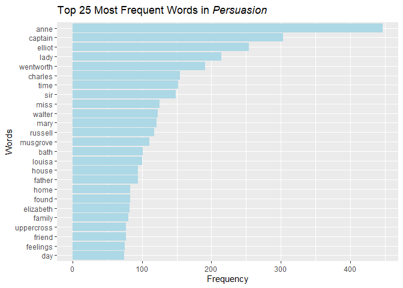
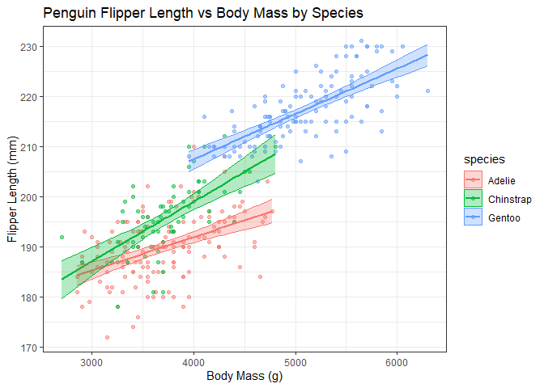

Assignment B4
================
Katia Rosenflanz
2024-12-03

## Overview

For Assignment B4, Option A- Strings and Functional Programming in R was
selected.

Solutions to both **Exercise 1** and **Exercise 3** are given below.

### Exercise 1

``` r
library(janeaustenr)
```

    ## Warning: package 'janeaustenr' was built under R version 4.4.2

``` r
library(tidyverse)
```

    ## Warning: package 'tidyverse' was built under R version 4.4.1

    ## Warning: package 'readr' was built under R version 4.4.1

    ## Warning: package 'stringr' was built under R version 4.4.1

    ## Warning: package 'forcats' was built under R version 4.4.1

    ## Warning: package 'lubridate' was built under R version 4.4.1

    ## ── Attaching core tidyverse packages ──────────────────────── tidyverse 2.0.0 ──
    ## ✔ dplyr     1.1.4     ✔ readr     2.1.5
    ## ✔ forcats   1.0.0     ✔ stringr   1.5.1
    ## ✔ ggplot2   3.5.1     ✔ tibble    3.2.1
    ## ✔ lubridate 1.9.3     ✔ tidyr     1.3.1
    ## ✔ purrr     1.0.2     
    ## ── Conflicts ────────────────────────────────────────── tidyverse_conflicts() ──
    ## ✖ dplyr::filter() masks stats::filter()
    ## ✖ dplyr::lag()    masks stats::lag()
    ## ℹ Use the conflicted package (<http://conflicted.r-lib.org/>) to force all conflicts to become errors

``` r
library(tidytext)
```

    ## Warning: package 'tidytext' was built under R version 4.4.2

``` r
library(palmerpenguins)
```

    ## Warning: package 'palmerpenguins' was built under R version 4.4.1

``` r
library(broom)
```

    ## Warning: package 'broom' was built under R version 4.4.1

For this exercise, the book *Persuasion* from the `janeaustenr` package
will be chosen for analysis. The `tidytext` package is used to define
“stop words” in the book. We can extract all words that are **not**
included in tidytext::stop_words with the help of the `tidytext`
package, which has very useful functions for text mining.

``` r
words <- tibble(text = persuasion) %>% #convert "Persuasion" into tibble  
  #unnest_tokens() converts to lowercase, removes punctuation, and splits into one word per row
  unnest_tokens(output = word, input = text) %>%
  anti_join(stop_words, join_by(word)) %>% #remove all rows with a match in stop_words
  count(word, sort = TRUE) #counts unique words and sorts by most frequent
```

We can now check how many unique words there are in *Persuasion*
(excluding stop words) by checking the length of the “word” column.

``` r
length(words$word)
```

    ## [1] 5340

There are 5340 unique words in the book (excluding stop words). It would
be impractical to plot all of the words, therefore we will plot only the
first 25.

``` r
#extract top 25 most frequent words 
top25 <- words[1:25,]
#plot word frequency
ggplot(top25, aes(x = reorder(word, n), n)) + 
  geom_col(fill = "lightblue") + 
  coord_flip()+ #move words to y axis 
  labs(title = expression(paste("Top 25 Most Frequent Words in ", italic("Persuasion"))),
                                x = "Words", y = "Frequency") #create title with italicized book title
```

<!-- -->

### Exercise 3

For the following data analysis, I will be utilizing the **penguins**
dataset from the `palmerpenguins` package. I will assess how the flipper
length (mm) is related to the body mass (g) of a penguin. I will do so
using a linear regression model. The model will be fit to each species
of penguin (Adelie, Gentoo, and Chinstrap) separately, and will be used
to generate “predicted” flipper length values for each observed body
mass value.

``` r
#create linear model using penguins dataset 
penguin_model <- penguins %>%
  #select only relevant columns
  select(species, body_mass_g, flipper_length_mm) %>%
  #nest data by species
  nest(data = c(body_mass_g, flipper_length_mm)) %>%
  #fit linear model to each species (making column of model objects)
  mutate(model = map(data, ~lm(flipper_length_mm ~body_mass_g, data = .)))

#print intermediate tibble for inspection 
penguin_model
```

    ## # A tibble: 3 × 3
    ##   species   data               model 
    ##   <fct>     <list>             <list>
    ## 1 Adelie    <tibble [152 × 2]> <lm>  
    ## 2 Gentoo    <tibble [124 × 2]> <lm>  
    ## 3 Chinstrap <tibble [68 × 2]>  <lm>

The intermediate tibble above shows that both the data and model columns
have nested tibbles for each species of penguin.

Next, the `broom` package can enable us to extract further information
about the linear models, specifically about the predicted values
generated using the model. This means that we can take a look at what
flipper length the model predicts based on a given observation of
penguin body mass.

``` r
#using broom::augment, can extract the fitted values for predicted flipper length based on each observed body mass value
#and the standard error of the predicted values
penguin_results <- penguin_model %>%
  mutate(species, yhat = map(model, ~augment(.x, se_fit = TRUE)), .keep = "none") %>%  #adds information about each observation using the model
  unnest(yhat) %>% #each data point has its own row, unnested
  select(species, flipper_length_mm, body_mass_g, .fitted, .resid, .se.fit) %>% #select only useful columns
  rename(predicted_flipper_length = .fitted, residual = .resid, se_fit = .se.fit) #rename columns for readability

#print cleaned unnested tibble 
penguin_results
```

    ## # A tibble: 342 × 6
    ##    species flipper_length_mm body_mass_g predicted_flipper_len…¹ residual se_fit
    ##    <fct>               <int>       <int>                   <dbl>    <dbl>  <dbl>
    ##  1 Adelie                181        3750                    190.   -9.28   0.475
    ##  2 Adelie                186        3800                    191.   -4.62   0.483
    ##  3 Adelie                195        3250                    187.    8.06   0.663
    ##  4 Adelie                193        3450                    188.    4.72   0.538
    ##  5 Adelie                190        3650                    190.    0.385  0.475
    ##  6 Adelie                181        3625                    189.   -8.45   0.478
    ##  7 Adelie                195        4675                    196.   -1.46   1.11 
    ##  8 Adelie                193        3475                    188.    4.55   0.526
    ##  9 Adelie                190        4250                    194.   -3.62   0.738
    ## 10 Adelie                186        3300                    187.   -1.28   0.627
    ## # ℹ 332 more rows
    ## # ℹ abbreviated name: ¹​predicted_flipper_length

We can next calculate 95% confidence intervals for the predicted values,
using the standard errors of the fit. This gives us an idea whether the
predictions have low or high uncertainty based on the model.

``` r
final_penguin <- penguin_results %>%
  mutate(low_ci = predicted_flipper_length -1.96*se_fit) %>% #lower bound of 95% confidence interval
  mutate(high_ci = predicted_flipper_length + 1.96*se_fit) %>% #higher bound of 95% confidence interval
  select(species, flipper_length_mm, body_mass_g, predicted_flipper_length, low_ci, high_ci)

#print the final tibble
final_penguin
```

    ## # A tibble: 342 × 6
    ##    species flipper_length_mm body_mass_g predicted_flipper_length low_ci high_ci
    ##    <fct>               <int>       <int>                    <dbl>  <dbl>   <dbl>
    ##  1 Adelie                181        3750                     190.   189.    191.
    ##  2 Adelie                186        3800                     191.   190.    192.
    ##  3 Adelie                195        3250                     187.   186.    188.
    ##  4 Adelie                193        3450                     188.   187.    189.
    ##  5 Adelie                190        3650                     190.   189.    191.
    ##  6 Adelie                181        3625                     189.   189.    190.
    ##  7 Adelie                195        4675                     196.   194.    199.
    ##  8 Adelie                193        3475                     188.   187.    189.
    ##  9 Adelie                190        4250                     194.   192.    195.
    ## 10 Adelie                186        3300                     187.   186.    189.
    ## # ℹ 332 more rows

Finally, we can generate a graph showing the observed data points, as
well as the predicted data points from the linear model for each of the
three species of penguin. The 95% confidence interval for the predicted
values is also shown as a shaded area around the fits.

``` r
# Visualization of model fit for flipper length versus body mass, colored by species of penguin
ggplot(final_penguin, aes(x = body_mass_g, y = flipper_length_mm, color = species)) +
  geom_point(alpha = 0.5) +
  geom_line(aes(y = predicted_flipper_length), linewidth = 1) + #show predicted values
  geom_ribbon(aes( ymin = low_ci, ymax = high_ci, fill = species), alpha = 0.3) +  #add 95% confidence interval
  labs(title = "Penguin Flipper Length vs Body Mass by Species",
    y = "Flipper Length (mm)",
    x = "Body Mass (g)") +
  theme_bw()
```

<!-- -->

For each of the three species of penguin, there is a positive
correlation between the body mass and flipper length based on the linear
model. Most Gentoo penguins demonstrate larger body mass and longer
flipper length compared to the other two species of penguin. The slope
of the curve is also steeper for the Chinstrap penguin; this indicates
that for small increases in body mass, flipper length increases more for
the Chinstrap compared to the Adelie. Each of the shaded confidence
intervals are fairly narrow, indicating that the standard errors of the
fit were quite low and that the model’s uncertainty is fairly low in
predicting flipper length.
